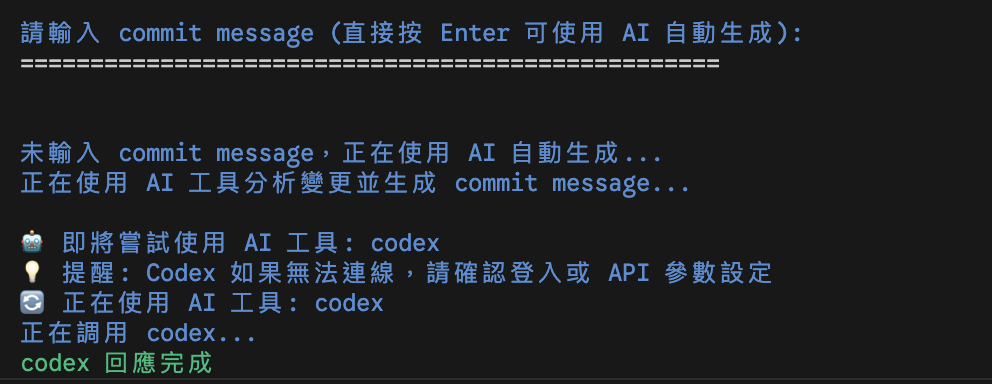
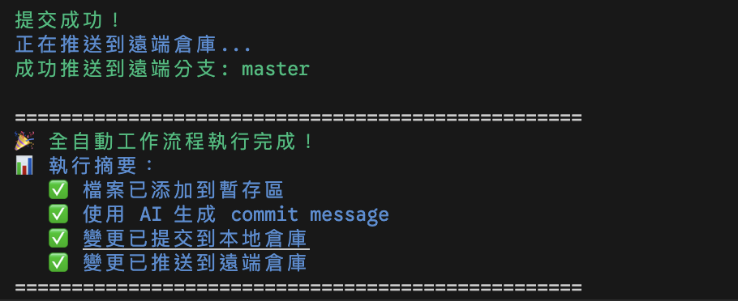

# Git Auto Push 自動推送工具

一個功能強大的 Git 工作流程自動化工具，提供完整的從變更檢測到遠端推送的一站式解決方案。

## 💡 靈感來源

此工具的靈感來自於 [@ihower](https://www.threads.com/@ihower) 在 Threads 上分享的 [Claude Code 自動化 Git 工作流程](https://www.threads.com/@ihower/post/DNnLBb6xDKF)。由於 Jerry 沒有訂閱 Claude Code 付費版，因此開發了這個支援多種 AI CLI 工具（Codex CLI、Gemini CLI、Claude CLI）的替代方案，讓更多開發者能夠享受 AI 輔助的 Git 自動化體驗。

## 📸 Screenshots

### 主要介面操作流程


_主要操作選單，提供四種不同的 Git 工作流程模式_

### AI 智能生成 Commit Message


_AI 工具自動分析程式碼變更並生成合適的 commit message_

### 全自動模式


_一鍵執行的全自動模式，完全無需人工介入_

> 📖 **使用指南**：完整的全自動模式設定和使用說明，請參閱 [AUTO_MODE_GUIDE.md](./AUTO_MODE_GUIDE.md)

## ✨ 主要功能

- 🔍 **自動檢測** Git 倉庫和變更狀態
- 📝 **AI 智能生成** commit message（支援多種 AI 工具）
- 🎯 **靈活選單** 四種操作模式：完整流程、本地提交、僅添加檔案、全自動模式
- 🎬 **Loading 動畫** AI 工具調用時的精美動畫效果
- 🌈 **彩色輸出** 提供清晰的視覺反饋和粗體突出顯示
- 🛡️ **安全確認** 每步操作都有確認機制和輸入緩衝區清理
- 🚀 **命令列支援** 支援全自動模式的命令列參數

## 🎯 操作模式

工具提供四種靈活的操作模式：

### 1. 🚀 完整流程 (預設)

- **流程**：add → commit → push
- **適用**：日常開發提交，完整的版本控制流程
- **特色**：包含 AI 生成 commit message、用戶確認等完整功能

### 2. 📝 本地提交

- **流程**：add → commit
- **適用**：離線開發、本地測試或暫不推送的情況
- **特色**：完成本地版本記錄，稍後可手動推送

### 3. 📦 僅添加檔案

- **流程**：add
- **適用**：分階段提交、檢查變更或暫存檔案
- **特色**：將變更添加到暫存區，保留提交控制權

### 4. 🤖 全自動模式 (新)

- **流程**：add → AI commit → push
- **適用**：快速提交、自動化腳本、CI/CD 整合
- **特色**：完全無需用戶介入，AI 自動生成 commit message 並推送
- **命令列**：支援 `--auto` 和 `-a` 參數直接啟用

> 📖 **詳細說明**：關於全自動模式的完整使用指南，請參閱 [AUTO_MODE_GUIDE.md](AUTO_MODE_GUIDE.md)

## 🎯 工作流程

1. **檢查 Git 倉庫**：驗證當前目錄是否為有效的 Git 倉庫
2. **檢測變更**：自動掃描並顯示所有變更的檔案
3. **無變更處理**：如沒有新變更，檢查是否有未推送的提交並提供推送選項
4. **添加檔案**：將所有變更添加到 Git 暫存區
5. **選擇模式**：用戶選擇要執行的操作範圍（或自動模式跳過此步）
6. **生成訊息**：智能 AI 生成或手動輸入 commit message（需要時）
7. **確認提交**：顯示提交資訊供用戶確認（需要時）
8. **執行操作**：根據選擇執行對應的 Git 操作

## 📦 安裝與使用

### 快速開始

1. **下載腳本到 git 專案根目錄**：

```bash
wget https://raw.githubusercontent.com/lazyjerry/git-auto-push/master/git-auto-push.sh
# 或
curl -O https://raw.githubusercontent.com/lazyjerry/git-auto-push/master/git-auto-push.sh
```

2. **添加執行權限**：

```bash
chmod +x git-auto-push.sh
```

3. **執行腳本**：

```bash
./git-auto-push.sh
```

### 全域安裝（推薦）

```bash
# 複製到系統路徑
sudo cp git-auto-push.sh /usr/local/bin/git-auto-push
sudo chmod +x /usr/local/bin/git-auto-push

# 現在可以在任何 Git 倉庫中使用
git-auto-push
```

### 創建別名

在你的 `~/.bashrc` 或 `~/.zshrc` 中添加：

```bash
alias gap="git-auto-push"  # 快速別名
alias gitpush="/path/to/git-auto-push.sh"
```

## 🎮 使用說明

### 基本使用

在任何 Git 倉庫目錄中執行：

```bash
./git-auto-push.sh
```

### 全自動模式

```bash
# 使用完整參數
./git-auto-push.sh --auto

# 使用簡短參數
./git-auto-push.sh -a
```

> 📖 **完整指南**：全自動模式的詳細設定和使用方法，請參閱 [AUTO_MODE_GUIDE.md](AUTO_MODE_GUIDE.md)

### 操作選項

1. **選擇模式**：

   - 數字 1-4 選擇操作模式
   - 直接按 Enter 使用預設模式

2. **commit message**：

   - 直接輸入 → 使用您的訊息
   - 按 Enter → 自動 AI 生成

3. **AI 生成失敗時**：
   - 輸入具體內容 → 使用手動輸入
   - 輸入 `ai` → 重新嘗試 AI 生成
   - 輸入 `q` → 取消操作

### 互動選項

1. **輸入 commit message**：

   - 直接輸入 → 使用您的訊息
   - 按 Enter → 自動 AI 生成

2. **AI 生成失敗時**：

   - 輸入具體內容 → 使用手動輸入
   - 輸入 `ai` → 重新嘗試 AI 生成
   - 輸入 `q` → 取消操作

3. **確認選項**：
   - `y/yes/是/確認` → 確認操作
   - `n/no/否/取消` → 取消操作

## 🤖 支援的 AI 工具

工具會依序檢查並使用以下 AI CLI 工具：

| 工具       | 說明                 | 優先級      |
| ---------- | -------------------- | ----------- |
| **codex**  | GitHub Copilot CLI   | 🥇 第一優先 |
| **gemini** | Google Gemini CLI    | 🥈 第二優先 |
| **claude** | Anthropic Claude CLI | 🥉 第三優先 |

### AI 工具設定

- **Codex**: 需要 GitHub Copilot 訂閱和 CLI 工具
- **Gemini**: 支援多種調用方式：
  - 直接使用 `gemini` 命令
  - 透過 `gcloud ai generative-models`
  - 使用 `google-generativeai` CLI
- **Claude**: 支援多種調用方式：
  - 直接使用 `claude` 命令
  - 使用 `anthropic` CLI
  - 使用 `claude-cli` 工具

## ⚙️ 配置設定

### 預設選項設定

可以修改腳本中的 `DEFAULT_OPTION` 變數來改變預設行為：

```bash
# 在 git-auto-push.sh 中修改這個變數
DEFAULT_OPTION=1  # 預設選項：1=完整流程, 2=add+commit, 3=僅add, 4=全自動
```

- **`DEFAULT_OPTION=1`**：預設執行完整流程（推薦）
- **`DEFAULT_OPTION=2`**：預設執行本地提交（適合離線開發）
- **`DEFAULT_OPTION=3`**：預設僅添加檔案（適合謹慎操作）
- **`DEFAULT_OPTION=4`**：預設執行全自動模式（適合自動化）

### AI 工具優先級

可以修改 `ai_tools` 陣列來調整 AI 工具的使用順序。**需要在兩個地方同時修改**：

#### 📍 修改位置 1：互動模式 AI 工具順序

**函數**：`generate_auto_commit_message()` （約第 437-441 行）

```bash
# 在 generate_auto_commit_message() 函數中
local ai_tools=(
    "codex"     # 第一優先
    "gemini"    # 第二優先
    "claude"    # 第三優先
)
```

#### 📍 修改位置 2：全自動模式 AI 工具順序

**函數**：`generate_auto_commit_message_silent()` （約第 369-373 行）

```bash
# 在 generate_auto_commit_message_silent() 函數中
local ai_tools=(
    "codex"     # 第一優先
    "gemini"    # 第二優先
    "claude"    # 第三優先
)
```

#### 🔧 修改範例

如果您想要讓 **Gemini 優先使用**，兩個位置都要修改為：

```bash
local ai_tools=(
    "gemini"    # 第一優先
    "codex"     # 第二優先
    "claude"    # 第三優先
)
```

#### ⚠️ 重要提醒

- **兩個地方都要修改**：確保互動模式和全自動模式使用相同的優先順序
- **保持一致性**：建議兩個函數使用相同的工具順序，避免混淆
- **測試驗證**：修改後建議測試確認新的優先順序是否按預期工作

## 🔧 系統需求

- **Shell**: bash, zsh, 或其他 POSIX 兼容 shell
- **Git**: 已安裝並配置的 Git
- **網路**: 推送到遠端倉庫時需要網路連接
- **AI 工具**（可選）: codex, gemini, claude 等 CLI 工具

## 💡 使用範例

### 範例 1：完整流程操作選單

```bash
$ ./git-auto-push.sh
Git 自動添加推送到遠端倉庫工具
==================================================
檢測到以下變更:
M  src/main.js
A  docs/api.md
正在添加所有變更的檔案...
檔案添加成功！

==================================================
請選擇要執行的 Git 操作:
==================================================
1. 🚀 完整流程 (add → commit → push)
2. 📝 本地提交 (add → commit)
3. 📦 僅添加檔案 (add)
==================================================
請輸入選項 [1-3] (直接按 Enter 使用預設選項 1):

✅ 已選擇：完整流程 (add → commit → push)
🚀 執行完整 Git 工作流程...

==================================================
請輸入 commit message (直接按 Enter 可使用 AI 自動生成):
==================================================

未輸入 commit message，正在使用 AI 自動生成...
正在調用 gemini...
⠋ 正在等待 gemini 回應 (3/30秒)
✅ gemini 回應完成

✅ 使用 gemini 生成的 commit message:
🔖 新增 API 文檔並優化主程式邏輯

🤖 AI 生成的 commit message:
🔖 新增 API 文檔並優化主程式邏輯
是否使用此訊息？(y/n，直接按 Enter 表示同意):

==================================================
確認提交資訊:
Commit Message: 新增 API 文檔並優化主程式邏輯
==================================================
是否確認提交？(y/n，直接按 Enter 表示同意):

正在提交變更...
提交成功！
正在推送到遠端倉庫...
成功推送到遠端分支: main

==================================================
🎉 完整工作流程執行完成！
==================================================
```

### 範例 2：僅本地提交模式

```bash
$ ./git-auto-push.sh
[...前面步驟相同...]

請輸入選項 [1-3] (直接按 Enter 使用預設選項 1): 2

✅ 已選擇：本地提交 (add → commit)
📝 執行本地 Git 提交...

[...commit message 選擇和確認...]

正在提交變更...
提交成功！

==================================================
📋 本地提交完成！
💡 提示：如需推送到遠端，請使用 'git push' 或重新運行腳本選擇選項 1
==================================================
```

### 範例 3：僅添加檔案模式

```bash
$ ./git-auto-push.sh
[...前面步驟相同...]

請輸入選項 [1-4] (直接按 Enter 使用預設選項 1): 3

✅ 已選擇：僅添加檔案 (add)
📦 僅執行檔案添加操作...

==================================================
📁 檔案添加完成！
💡 提示：檔案已添加到暫存區，如需提交請使用 'git commit' 或重新運行腳本選擇選項 2
==================================================
```

### 範例 4：全自動模式

> 📖 **詳細說明**：更多全自動模式的使用方法和配置選項，請參閱 [AUTO_MODE_GUIDE.md](AUTO_MODE_GUIDE.md)

```bash
$ ./git-auto-push.sh --auto
🤖 命令行啟用全自動模式
Git 自動添加推送到遠端倉庫工具
==================================================
檢測到以下變更:
M  src/components/navbar.js
A  docs/changelog.md
正在添加所有變更的檔案...
檔案添加成功！
🤖 執行全自動 Git 工作流程...
💡 提示：全自動模式將使用 AI 生成 commit message 並自動完成所有步驟
🤖 全自動模式：正在使用 AI 工具分析變更並生成 commit message...
🔄 自動使用 AI 工具: codex
⠋ 正在等待 codex 回應 (2/45秒)
✅ codex 回應完成
✅ 自動使用 codex 生成的 commit message:
🔖 新增導航列組件並更新變更日誌

==================================================
🤖 全自動提交資訊:
📝 Commit Message: 新增導航列組件並更新變更日誌
==================================================
正在提交變更...
提交成功！
正在推送到遠端倉庫...
成功推送到遠端分支: main

==================================================
🎉 全自動工作流程執行完成！
📊 執行摘要：
   ✅ 檔案已添加到暫存區
   ✅ 使用 AI 生成 commit message
   ✅ 變更已提交到本地倉庫
   ✅ 變更已推送到遠端倉庫
==================================================
```

### 範例 5：無變更但有未推送提交

```bash
$ ./git-auto-push.sh
Git 自動添加推送到遠端倉庫工具
==================================================
沒有需要提交的變更。

檢測到 2 個未推送的本地提交。

是否要將本地提交推送到遠端倉庫？(y/n，直接按 Enter 表示同意):

正在推送到遠端倉庫...
成功推送到遠端分支: main
🎉 推送完成！
```

## ⚠️ 注意事項

- **備份重要**：使用前請確保重要變更已備份
- **檢查變更**：腳本會顯示所有變更，請仔細檢查
- **網路連接**：推送時需要穩定的網路連接
- **權限確認**：確保對遠端倉庫有推送權限
- **API 設定**：AI 功能需要相應的 API key 或登入認證
- **輸入處理**：每次確認都會清空輸入緩衝區，避免意外的自動確認

## 🐛 故障排除

### 常見問題

**Q: AI 工具顯示 "Invalid API key"**

```bash
# Claude 登入
claude login

# GitHub Copilot 登入
gh auth login
```

**Q: 確認步驟被自動跳過**

- v1.0+ 版本已修正輸入緩衝區問題
- 每次確認都會清空前一步的輸入殘留
- 確保用戶必須明確輸入選擇

**Q: 推送失敗**

- 檢查網路連接
- 確認遠端倉庫權限
- 檢查分支名稱是否正確

**Q: 顏色顯示異常**

- 確保終端支援 ANSI 顏色
- 嘗試不同的終端應用程式

## 🔄 更新日誌

### v1.3 (2025-08-21)

- 🤖 **全自動模式**：新增第四種操作模式，完全無需用戶介入的自動化流程（詳見 [AUTO_MODE_GUIDE.md](AUTO_MODE_GUIDE.md)）
- 🚀 **命令列支援**：支援 `--auto` 和 `-a` 參數直接啟用全自動模式
- 📤 **智能推送**：無變更時自動檢測未推送的提交並提供推送選項
- 🔄 **增強處理**：改善無變更情況的用戶體驗和操作流程
- 🎯 **AI 優先級調整**：根據實際測試調整 AI 工具使用順序（codex 優先）

### v1.2 (2025-08-21)

- 🎯 **新增操作選單**：提供三種操作模式選擇（完整流程、本地提交、僅添加檔案）
- 🎬 **Loading 動畫**：AI 工具調用時顯示精美的旋轉動畫和進度提示
- 🎨 **視覺優化**：AI 生成的 commit message 使用粗體綠色和圖標突出顯示
- ⚙️ **可配置選項**：支援修改預設操作模式和 AI 工具優先級
- 📦 **模組化重構**：將不同操作模式拆分為獨立函數，提升可維護性

### v1.1 (2025-08-21)

- 🐛 **修正輸入緩衝區問題**：解決 AI 確認後自動跳過最終確認的問題
- 🔧 **改善用戶體驗**：每次確認步驟都會清空前一步的輸入殘留
- ✨ **增強安全性**：確保用戶必須明確輸入每一步的確認選擇

### v1.0 (2025-08-20)

- 🎉 **首次發布**：完整的 Git 工作流程自動化
- 🤖 **AI 整合**：支援 codex、gemini、claude 等 AI 工具
- 🌈 **彩色介面**：提供清晰的視覺反饋
- 🛡️ **安全機制**：每步操作都有確認提示

## 🤝 貢獻

歡迎提交 Issue 和 Pull Request！

1. Fork 本倉庫
2. 創建功能分支 (`git checkout -b feature/amazing-feature`)
3. 提交變更 (`git commit -m 'Add some amazing feature'`)
4. 推送分支 (`git push origin feature/amazing-feature`)
5. 開啟 Pull Request

## 📄 授權條款

本專案採用 MIT License - 查看 [LICENSE](LICENSE) 檔案了解詳情。

## 👨‍💻 作者

**A Bit of Vibe Jerry**

- GitHub: [@lazyjerry](https://github.com/lazyjerry)

## 🌟 致謝

感謝所有貢獻者和使用者的支持！

---

如果這個工具對您有幫助，請給個 ⭐️ Star 支持一下！
