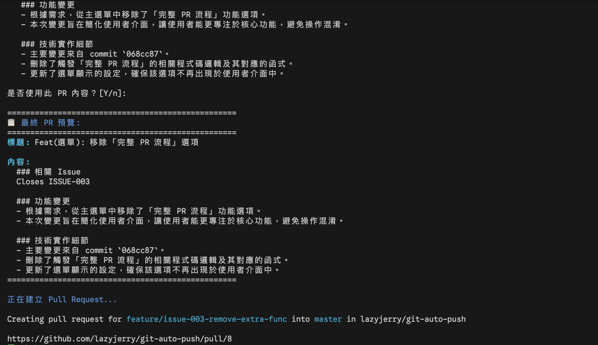
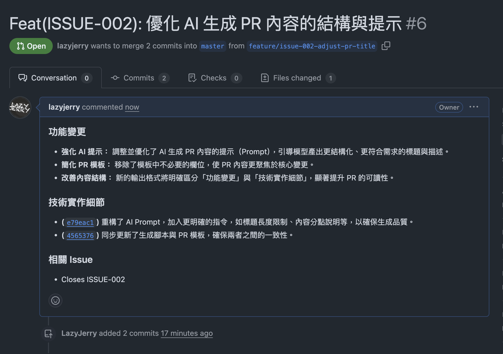

# Git 工作流程自動化工具集

完整的 Git 工作流程自動化解決方案，包含傳統 Git 操作自動化和現代 Flow PR 流程。整合 AI 驅動的智慧產生功能和企業級錯誤處理機制。

## 專案簡介

一句話價值主張：**讓 Git 工作流程變得像按一個按鈕一樣簡單**

主要功能亮點：

- 傳統 Git 工作流程完全自動化（新增、提交、推送）
- GitHub Flow PR 流程端到端自動化（分支建立到 PR 建立）
- **PR 生命週期完整管理**（建立、撤銷、審查、合併）
- **智慧分支管理系統** 🆕（安全刪除、主分支保護、多重確認）
- AI 驅動的智慧內容產生（commit 訊息、分支名稱、PR 內容）
- 企業級錯誤處理與智慧修復建議
- 多 AI 工具整合與自動容錯機制
- - **專業級程式碼文件** ✨：為所有主要函數加入企業級註解標準
- 中斷復原和信號處理機制

## 系統架構

### 核心元件架構

```
├── git-auto-push.sh      # 傳統 Git 工作流程自動化（1294 行，完整註解）
├── git-auto-pr.sh        # GitHub Flow PR 流程自動化（2263 行，企業級文件）
├── AI 工具整合模組        # 支援 codex、gemini、claude
│   ├── 智慧錯誤偵測      # 認證過期、網路錯誤自動識別
│   ├── 友善錯誤提示      # 提供具體解決方案
│   ├── 多工具容錯機制    # AI 工具失效時的備援機制
│   └── 輸出清理系統      # 過濾 AI 工具中繼資料和技術雜訊
├── 互動式選單系統        # 直覺的操作選項與使用者體驗
├── Loading 動畫系統      # 美觀的等待提示與進度顯示
├── 信號處理機制          # 多層級 trap cleanup 與中斷復原
├── 錯誤處理系統          # 完整的異常處理與修復引導
└── 專業級程式碼文件 🆕     # 統一函數註解、詳細使用說明、安全機制文件
```

### 專案結構

```
├── git-auto-push.sh      # 傳統 Git 自動化工具
├── git-auto-pr.sh        # GitHub Flow PR 自動化工具
├── AGENTS.md            # 專案開發指引與規範
├── LICENSE              # MIT 授權條款
├── README.md            # 專案說明文件
├── .github/             # GitHub 相關設定
│   ├── copilot-instructions.md    # AI 代理開發指導
│   └── instructions/              # 程式碼產生規範
│       ├── copilot-readme.instructions.md
│       └── copilot-bash-doc-tw-instructions.md
├── docs/                # 文件目錄
│   ├── github-flow.md   # GitHub Flow 流程說明
│   └── pr-cancel-feature.md  # PR 撤銷功能說明
└── screenshots/         # 介面展示圖片
    ├── ai-commit-generation.png
    ├── auto-mode.png
    ├── main-menu.png
    ├── pr-screenshot-cli.png
    └── pr-screenshot-web.png
```

## 安裝與啟動

### 1. 複製專案

```bash
git clone https://github.com/lazyjerry/git-auto-push.git
cd git-auto-push
```

### 2. 設定執行權限

```bash
chmod +x git-auto-push.sh
chmod +x git-auto-pr.sh
```

### 3. 全域安裝（選擇性）

```bash
# 安裝 git-auto-push 到系統路徑
sudo install -m 755 git-auto-push.sh /usr/local/bin/git-auto-push

# 安裝 git-auto-pr 到系統路徑
sudo install -m 755 git-auto-pr.sh /usr/local/bin/git-auto-pr
```

### 4. 相依工具安裝

#### GitHub CLI（git-auto-pr.sh 必需）

```bash
# macOS
brew install gh
gh auth login  # 選擇 GitHub.com → HTTPS → Browser 登入
```

#### AI CLI 工具（可選，建議）

安裝任一或多個 AI CLI 工具以啟用智慧產生功能：

```bash
# GitHub Copilot CLI (建議)
gh extension install github/gh-copilot

# Google Gemini CLI (需要 API Key)
# 安裝方式請參考 Google AI Studio 官方文件

# Anthropic Claude CLI (需要 API Key)
# 安裝方式請參考 Anthropic Console 官方文件

# 或其他相容的 AI CLI 工具
# 工具會自動偵測可用的 AI 命令
```

**注意**：AI 工具需要相應的 API 金鑰或訂閱服務。如未安裝，工具仍可正常使用，僅會跳過 AI 輔助功能。

## 使用方法

### git-auto-push.sh - 傳統 Git 自動化

```bash
# 互動式模式（預設）
./git-auto-push.sh

# 全自動模式
./git-auto-push.sh --auto
./git-auto-push.sh -a

# 全域安裝後使用
git-auto-push
git-auto-push --auto
```

#### git-auto-push.sh 操作模式

| 模式          | 功能描述                     | 使用情境           |
| ------------- | ---------------------------- | ------------------ |
| 1. 完整流程   | add → 互動輸入 commit → push | 日常開發提交       |
| 2. 本機提交   | add → 互動輸入 commit        | 離線開發或測試提交 |
| 3. 僅新增檔案 | add                          | 暫存檔案變更       |
| 4. 全自動模式 | add → AI 產生 commit → push  | CI/CD 或快速提交   |
| 5. 僅提交     | commit                       | 提交已暫存的檔案   |

### git-auto-pr.sh - GitHub Flow PR 自動化 ✨

```bash
# 互動式模式（預設）
./git-auto-pr.sh

# 全自動模式
./git-auto-pr.sh --auto
./git-auto-pr.sh -a

# 全域安裝後使用
git-auto-pr
git-auto-pr --auto
```

#### git-auto-pr.sh 操作模式

| 模式             | 功能描述                       | 使用情境           |
| ---------------- | ------------------------------ | ------------------ |
| 1. 建立功能分支  | 基於 main 建立 feature 分支    | 開始新功能開發     |
| 2. 建立 PR       | 基於目前分支建立 Pull Request  | 提交程式碼審查     |
| 3. 撤銷目前 PR   | 關閉開放 PR / Revert 已合併 PR | PR 錯誤修正        |
| 4. 審查與合併 PR | 審查 → 批准/請求變更 → 合併    | 專案擁有者 PR 管理 |
| 5. 刪除分支      | 安全刪除本地/遠端功能分支      | 分支清理與維護     |

#### GitHub Flow 工作流程特色

- **Issue 整合**: 支援 JIRA、GitHub Issue 等多種編號格式
- **AI 智慧產生**: 分支名稱、commit message、PR 標題和內容均可 AI 輔助
- **PR 生命週期管理**: 建立 → 撤銷 → 審查 → 合併，完整涵蓋 PR 各階段操作
- **智慧撤銷機制**: 自動偵測 PR 狀態，提供安全的關閉或 revert 選項
- **完整驗證**: 檢查 Git 儲存庫、gh CLI 登入狀態、分支狀態
- **企業級錯誤處理**: 智慧錯誤偵測與友善修復建議
- **中斷復原**: 支援 Ctrl+C 中斷與優雅清理
- **多分支支援**: 自動偵測 main/master 主分支

## 使用情境

### git-auto-push.sh 使用情境

#### 日常開發流程

```bash
# 修改程式碼後，執行完整流程
./git-auto-push.sh
# 選擇選項 1，輸入 commit message，自動推送
```

#### 快速自動提交

```bash
# AI 自動生成 commit message 並推送
./git-auto-push.sh --auto
```

#### 離線開發

```bash
# 只提交到本地，不推送
./git-auto-push.sh
# 選擇選項 2
```

#### 分階段操作

```bash
# 先新增檔案
./git-auto-push.sh  # 選擇選項 3

# 稍後提交
./git-auto-push.sh  # 選擇選項 5
```

### git-auto-pr.sh 使用情境 ✨

#### GitHub Flow 開發流程

```bash
# 1. 開始新功能開發
./git-auto-pr.sh
# 選擇選項 1，輸入 JIRA-123 和功能描述，AI 生成分支名稱

# 2. 開發完成後建立 PR
./git-auto-pr.sh
# 選擇選項 2（建立 PR）
# AI 產生 PR 標題和內容
```

#### 快速 PR 建立

```bash
# 在功能分支上快速建立 PR
./git-auto-pr.sh --auto
```

#### 撤銷 Pull Request

```bash
# 撤銷當前分支的 PR（智慧檢測 PR 狀態）
./git-auto-pr.sh
# 選擇選項 3（撤銷當前 PR）
# 系統會自動偵測：
# - 開放中的 PR：提供關閉選項
# - 已合併的 PR：提供 revert 選項（預設為否）
# - 顯示詳細影響分析供決策參考
```

#### 分步驟操作

```bash
# 1. 建立功能分支
./git-auto-pr.sh  # 選擇選項 1
# 輸入 JIRA-123，開發完成後...

# 2. 建立 PR
./git-auto-pr.sh  # 選擇選項 2
# AI 產生 PR 標題和內容

# 3. 如需撤銷 PR（錯誤提交、需要重構等）
./git-auto-pr.sh  # 選擇選項 3
# 系統自動檢測並提供撤銷選項
```

#### 團隊協作場景

```bash
# 開發者：基於 main 分支開始新功能
git checkout main && git pull
./git-auto-pr.sh  # 選擇選項 1，建立 feature/JIRA-123-new-feature

# 開發者：功能完成，建立 PR 供審查
./git-auto-pr.sh  # 選擇選項 2（建立 PR）

# 專案擁有者：審查並合併 PR
./git-auto-pr.sh  # 選擇選項 4，審查 → 批准 → 合併
```

#### 專案擁有者 PR 管理

```bash
# 查看和審查待處理的 PR
./git-auto-pr.sh  # 選擇選項 4

# 系統會自動：
# 1. 列出所有待審查的 PR
# 2. 顯示選定 PR 的詳細資訊和 CI 狀態
# 3. 提供審查選項：批准並合併、添加評論、請求變更
# 4. 自動使用 squash 合併並刪除功能分支
# 5. 更新本地 main 分支
```

#### 分支管理與清理 🆕

```bash
# 清理不需要的功能分支
./git-auto-pr.sh  # 選擇選項 5

# 系統會自動：
# 1. 列出所有可刪除的分支（排除主分支）
# 2. 標記當前分支，防止誤刪
# 3. 提供多重安全確認機制
# 4. 智慧處理已合併/未合併分支
# 5. 可選擇同時清理對應的遠端分支
```

## 特色功能

### AI 智慧產生系統

**多 AI 工具整合**

- 支援 codex、gemini、claude 三種 AI CLI 工具
- 自動容錯機制：當一個 AI 工具失效時自動嘗試下一個
- 智慧輸出清理：過濾 AI 工具的元數據和技術雜訊
- **提示優化**：精簡 70%+ 提示長度，提升處理速度和準確性

**智慧內容產生**

- commit 訊息：分析 git diff 自動產生符合 Conventional Commits 規範的訊息
- 分支名稱：根據 issue 編號和功能描述產生 GitHub Flow 標準分支名
- PR 內容：基於分支變更歷史產生專業的 PR 標題和描述
- **即時驗證**：自動檢測分支名稱有效性並處理特殊字符

### 企業級錯誤處理

**智慧錯誤偵測與修復**

- 自動偵測 `401 Unauthorized` 和 `token_expired` 認證錯誤
- 偵測 `stream error`、網路超時等連接問題
- **GitHub 政策合規**：自動偵測 PR 自我批准限制並提供替代方案
- 提供具體的修復命令和操作步驟

**用戶體驗優化**

- 彩色格式化的錯誤訊息與成功提示
- Loading 動畫顯示操作進度和等待時間
- 即時停止無效重試，避免浪費時間
- 中斷恢復機制：支援 Ctrl+C 優雅退出

### 工作流程自動化

**傳統 Git 流程（git-auto-push.sh）**

- 5 種操作模式滿足不同開發場景
- 支援離線開發和 CI/CD 整合
- 分階段操作支援：添加 → 提交 → 推送

**GitHub Flow 流程（git-auto-pr.sh）**

- 端到端 PR 流程自動化
- **智慧 PR 撤銷系統** 🆕：自動偵測 PR 狀態，安全處理開放和已合併 PR
- **智慧分支設定系統** ✨：可設定主分支候選清單，按優先順序自動偵測
- 分支錯誤處理：找不到主分支時提供詳細解決建議和修復命令
- 分支狀態智慧驗證
- **PR 審查管理**：自動偵測用戶身份避免自我批准，提供團隊審查或直接合併選項
- **安全保護機制**：revert 操作預設為否，顯示詳細影響分析
- **智慧分支管理** 🆕：安全的分支刪除功能，主分支保護與多重確認機制
- **分支生命週期管理** 🆕：完整的分支建立、使用、清理流程，主分支保護機制

## 錯誤排除

### 常見問題及解決方案

**錯誤：`目前目錄不是 Git 儲存庫！`**

```bash
# 確認在 Git 儲存庫根目錄執行
git init  # 或移動到正確的 Git 儲存庫目錄
```

**錯誤：`沒有需要提交的變更`**

- 檢查是否有檔案變更：`git status`
- 或選擇推送現有提交到遠端

**AI 工具認證錯誤**

```bash
❌ codex 認證錯誤: 認證令牌已過期
💡 請執行以下命令重新登入 codex:
   codex auth login
```

當出現 `401 Unauthorized` 或 `token_expired` 錯誤時，按提示重新認證。

**GitHub CLI 相關錯誤（git-auto-pr.sh）**

```bash
❌ 未安裝 gh CLI 工具！請執行：brew install gh
❌ gh CLI 未登入！請執行：gh auth login
```

確保已安裝並登入 GitHub CLI。

**分支狀態錯誤**

```bash
❌ 無法從主分支 (master) 建立 PR
❌ 分支尚未推送到遠端
```

確保在功能分支上操作，並已推送到 GitHub。

**PR 審查權限錯誤**

```bash
❌ Can not approve your own pull request
⚠️  無法批准自己的 Pull Request
```

GitHub 安全政策不允許開發者批准自己的 PR。解決方案：

- 請其他團隊成員使用此工具進行審查
- 如有權限可選擇直接合併
- 或使用評論功能進行自我記錄

**PR 撤銷相關錯誤**

```bash
❌ 當前分支沒有找到相關的 PR
⚠️  PR 已經合併，執行 revert 會影響到後續變更
```

PR 撤銷功能的常見情況處理：

- **找不到 PR**：確認在正確的功能分支上，或手動檢查其他分支
- **已合併 PR**：系統會顯示影響範圍，revert 操作預設為否需明確確認
- **revert 衝突**：按提示手動解決衝突後完成操作
- **權限不足**：確保有關閉 PR 或推送到主分支的權限

**主分支自動偵測**

工具智慧偵測主分支名稱：

- 優先偵測遠端 `origin/main` 分支
- 備選偵測 `origin/master` 分支
- 本地分支作為最後選項
- 同時支援現代儲存庫（main）和傳統儲存庫（master）

**AI 工具網路錯誤**

```bash
❌ codex 網路錯誤: stream error: unexpected status
💡 請檢查網路連接或稍後重試
```

網路問題會自動檢測並提供具體建議。

**AI 工具無法使用**

```bash
# 檢查 AI CLI 工具是否已安裝並可執行
which codex
which gemini
which claude
```

**權限不足錯誤**

```bash
# 確認腳本具有執行權限
chmod +x git-auto-push.sh
chmod +x git-auto-pr.sh
```

**推送失敗**

- 檢查遠端倉庫連接：`git remote -v`
- 確認網路連線和認證設定

## 進階使用

### GitHub Flow 最佳實踐整合

本工具集完整支援 [GitHub Flow](docs/github-flow.md) 企業級工作流程：

**工具選擇建議**

- **git-auto-push.sh**: 個人開發、實驗專案、快速原型
- **git-auto-pr.sh**: 團隊協作、企業專案、正式功能開發

### 實際工作流程範例

**個人開發流程**

```bash
# 快速提交和推送
git-auto-push --auto
```

**團隊協作流程**

```bash
# 1. 建立功能分支
git-auto-pr                    # 選擇選項 1

# 2. 開發完成後
git-auto-pr                    # 選擇選項 2（提交推送）

# 3. 建立 PR 供審查
git-auto-pr                    # 選擇選項 3（建立 PR）
```

### CI/CD 整合支援

兩個工具均支援 `--auto` 無互動模式，適合自動化環境：

**GitHub Actions 範例**

```yaml
name: Auto Git Workflow
on: [push]

jobs:
  auto-commit:
    runs-on: ubuntu-latest
    steps:
      - uses: actions/checkout@v3
      - name: Auto commit changes
        run: ./git-auto-push --auto

  auto-pr:
    runs-on: ubuntu-latest
    steps:
      - uses: actions/checkout@v3
      - name: Auto create PR
        run: ./git-auto-pr --auto
        env:
          GH_TOKEN: ${{ secrets.GITHUB_TOKEN }}
```

**Docker 容器整合**

```dockerfile
# 在容器中使用工具
COPY git-auto-*.sh /usr/local/bin/
RUN chmod +x /usr/local/bin/git-auto-*
CMD ["git-auto-push", "--auto"]
```

## 開發修改注意事項

### 🛠️ 程式碼架構說明

本專案採用模組化設計，主要組件包括：

#### 設定區域總覽

- **位置**：兩個腳本檔案的開頭部分
- **git-auto-push.sh**：第 28-52 行 - AI 工具優先順序和提示詞配置
- **git-auto-pr.sh**：第 25-78 行 - AI 提示詞模板、工具設定和分支設定
- **修改原則**：所有設定都集中在檔案上方，便於維護和修改

#### 分支設定系統（NEW! ✨）

**git-auto-pr.sh** 新增智慧分支設定功能：

- **主分支陣列設定**：`DEFAULT_MAIN_BRANCHES=("main" "master")
- **自動檢測機制**：按順序檢測第一個存在的分支
- **錯誤處理**：找不到分支時提供詳細解決建議
- **易於擴展**：可添加 `develop`、`dev` 等更多分支選項

#### 統一變數管理

- **AI_TOOLS 變數**：統一的 AI 工具優先順序陣列
- **readonly 保護**：防止意外修改配置
- **調用順序**：codex → gemini → claude

### � 代碼文檔標準

本專案採用企業級代碼文檔標準，所有主要函數都包含：

```bash
# ============================================
# 函數名稱
# 功能：詳細描述函數用途和行為
# 參數：$1 - 參數說明，$2 - 參數說明
# 返回：返回值含義和錯誤代碼
# 使用：具體的調用範例
# 注意：安全考量和特殊情況
# ============================================
```

**文件涵蓋範圍**：

- ✅ 所有工具函數（錯誤處理、訊息顯示、Git 操作）
- ✅ 核心業務邏輯（分支管理、PR 處理、AI 整合）
- ✅ 安全機制說明（權限檢查、多重確認、錯誤處理）
- ✅ 使用範例和最佳實踐

### �📝 修改指導原則

#### 1. AI 提示詞修改

```bash
# 修改位置：檔案開頭的 AI 提示詞配置區域
generate_ai_branch_prompt() {
    # 修改分支名稱生成邏輯
}

generate_ai_commit_prompt() {
    # 修改 commit 訊息生成邏輯
}

generate_ai_pr_prompt() {
    # 修改 PR 內容生成邏輯
}
```

#### 2. AI 工具順序調整

```bash
# 修改 AI_TOOLS 陣列即可改變調用順序
readonly AI_TOOLS=(
    "codex"     # 第一優先
    "gemini"    # 第二優先
    "claude"    # 第三優先
)
```

#### 3. 新增 AI 工具

1. 在 `AI_TOOLS` 陣列中添加新工具名稱
2. 在對應函數中添加 case 分支處理
3. 實現對應的 `run_*_command()` 函數

#### 4. 分支配置自定義 ✨

```bash
# git-auto-pr.sh 分支配置修改（第 78 行）
readonly -a DEFAULT_MAIN_BRANCHES=("main" "master")

# 添加更多分支選項
readonly -a DEFAULT_MAIN_BRANCHES=("main" "master" "develop" "dev")

# 只使用特定分支
readonly -a DEFAULT_MAIN_BRANCHES=("main")
```

**配置說明**：

- **檢測順序**：腳本會按陣列順序檢測第一個存在的分支
- **錯誤處理**：找不到任何分支時會顯示詳細錯誤訊息和解決建議
- **動態提示**：錯誤訊息會根據配置陣列動態生成修復指令

#### 5. 錯誤處理擴展

- 在現有錯誤檢測函數中添加新的錯誤模式
- 更新錯誤訊息和修復建議
- 保持一致的錯誤輸出格式

### ⚠️ 重要注意事項

#### 同步修改要求

- **AI 工具整合**：修改 AI 工具時，需同時更新兩個腳本檔案
- **提示詞優化**：兩個檔案的提示詞風格應保持一致
- **錯誤處理**：統一的錯誤處理模式和輸出格式

#### 測試要求

```bash
# 語法檢查
bash -n git-auto-push.sh
bash -n git-auto-pr.sh

# 功能測試
./git-auto-push.sh --help
./git-auto-pr.sh --help

# AI 工具測試
source git-auto-push.sh
for tool in "${AI_TOOLS[@]}"; do echo "測試 $tool"; done
```

#### 版本控制

- 修改後更新版本號
- 更新 README 中的行數統計
- 記錄重要變更到 commit message

### 🔧 常見修改場景

#### 場景 1：優化 AI 提示詞

1. 修改對應的 `generate_ai_*_prompt()` 函數
2. 測試生成效果
3. 更新相關文檔

#### 場景 2：新增錯誤處理

1. 識別新的錯誤模式
2. 在檢測函數中添加條件判斷
3. 提供具體的修復建議

#### 場景 3：調整工作流程

1. 修改 `execute_*_workflow()` 函數
2. 更新選單顯示
3. 測試完整流程

## 📋 更新日誌

### ✨ 最新版本亮點 (v1.4.1)

- **1294 行** git-auto-push.sh - 傳統 Git 工作流程自動化，含完整註解
- **2263 行** git-auto-pr.sh - GitHub Flow PR 自動化，企業級程式碼文件
- **5 種操作模式** - 完整涵蓋 Git 和 PR 生命週期管理
- **智慧分支管理** - 安全刪除機制，主分支保護，多重確認
- **專業文件標準** - 所有函數都有完整的企業級註解

---

### v1.4.1 - 分支管理系統與程式碼文件化 (2025-10-04)

**🆕 新功能**

- **智慧分支刪除系統** 🆕：新增安全的分支刪除功能，支援本地和遠端分支清理
- **主分支保護機制**：絕對禁止刪除主分支，可設定 DEFAULT_MAIN_BRANCHES 變數
- **當前分支智慧處理**：自動偵測當前分支，提供切換後刪除的安全流程
- **多重確認機制**：分級確認系統，防止誤刪重要分支
- **專業級程式碼文件** ✨：為所有主要函數加入企業級註解標準

**🔧 改進**

- 選單擴展：從 4 選項擴展為 5 選項，新增分支管理功能
- 安全設計：未合併分支需要額外確認，已合併分支可安全刪除
- 遠端同步：可選擇同時刪除對應的遠端分支
- 智慧偵測：自動識別分支狀態和合併情況

- **程式碼品質提升**：
  - 統一函數註解格式（功能、參數、返回值、使用範例）
  - 完整的檔案標頭文件（版本、作者、使用指南、系統需求）
  - 詳細的安全機制和錯誤處理說明
  - 企業級程式碼標準實施

**📊 行數統計更新**

- `git-auto-push.sh`：1294 行（+54 行註解）
- `git-auto-pr.sh`：2263 行（+163 行註解）

### v1.3.0 - PR 撤銷功能與選單重構 (2025-09-15)

**🆕 新功能**

- **PR 撤銷系統**：新增智慧 PR 撤銷功能，支援開放中 PR 關閉和已合併 PR 的 revert
- **安全檢查機制**：顯示合併後影響的 commit 數量，revert 操作預設為否
- **選單結構優化**：將 PR 管理子選項提升為主選項，操作更直觀

**🔧 改進**

- 選單重構：從 3 選項擴展為 4 選項，移除子選單層級
- 智慧分析：檢測 PR 狀態並提供對應操作選項（關閉/revert）
- 安全設計：所有破壞性操作都需要用戶明確確認

**📁 新增文檔**

- `docs/pr-cancel-feature.md` - PR 撤銷功能詳細說明

**📊 行數統計更新**

- `git-auto-pr.sh`：1876 行（+426 行）

### v1.2.0 - 分支配置系統 (2025-09-14)

**🆕 新功能**

- **智慧分支配置**：git-auto-pr.sh 新增 `DEFAULT_MAIN_BRANCHES` 陣列配置
- **自動檢測機制**：按優先順序自動檢測第一個存在的主分支
- **錯誤處理優化**：找不到分支時提供詳細解決建議和動態修復命令

**🔧 改進**

- 配置集中化：所有分支相關設定移至檔案頂部
- 錯誤訊息彩色化：使用表情符號和顏色提升可讀性
- 動態建議生成：根據配置陣列自動產生對應的 Git 命令

**📍 設定位置**

- `git-auto-pr.sh` 第 78 行：`readonly -a DEFAULT_MAIN_BRANCHES=("main" "master")`

### v1.1.0 - AI 配置整合 (2025-09-13)

**🔧 重構**

- AI 提示詞提取至檔案頂部作為配置變數
- 統一 AI_TOOLS 變數，便於維護
- 新增 README 開發修改指導說明

### 📚 參考資源

- [AGENTS.md](AGENTS.md) - 詳細開發指引
- [.github/copilot-instructions.md](.github/copilot-instructions.md) - AI 代理指導
- [docs/github-flow.md](docs/github-flow.md) - GitHub Flow 說明
- [docs/pr-cancel-feature.md](docs/pr-cancel-feature.md) - PR 撤銷功能詳細說明

## 截圖展示

| 功能            | 描述                            | 截圖                                             |
| --------------- | ------------------------------- | ------------------------------------------------ |
| 主選單介面      | git-auto-pr.sh 主要操作選單     |              |
| AI 提交訊息生成 | AI 自動生成 Git 提交訊息        |  |
| 全自動模式      | git-auto-push.sh 全自動操作模式 |            |
| PR 建立（CLI）  | 命令列 PR 建立流程              |      |
| PR 建立（Web）  | GitHub 網頁 PR 建立結果         |      |

## 授權條款

本專案採用 MIT 授權條款。詳細資訊請參閱 [LICENSE](LICENSE) 檔案。
