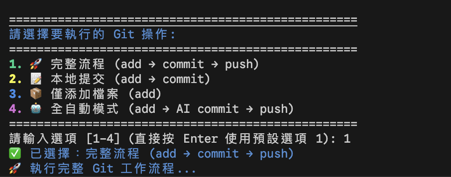

# Git 工作流程自動化工具集

Git 工作流程自動化解決方案，包含傳統 Git 操作自動化和 GitHub Flow PR 流程。整合 AI 驅動的內容產生功能、Conventional Commits 前綴支援、Commit 訊息品質檢查、任務編號自動帶入、調試模式和錯誤處理機制。

版本：v2.8.0

## 專案簡介

### 主要功能亮點

- 傳統 Git 工作流程自動化（新增、提交、推送）
- **Conventional Commits 前綴支援** 🆕（手動選擇或 AI 自動判斷 feat/fix/docs 等前綴）
- **命令列直接執行** 🆕（支援 `./git-auto-push.sh 1-7` 跳過選單直接執行）
- Git 倉庫資訊查看（分支狀態、遠端配置、同步狀態、提交歷史）
- Commit 訊息修改功能（安全修改最後一次 commit 訊息，支援任務編號）
- Commit 訊息品質檢查 🆕（AI 驅動的提交品質檢測，可配置自動檢查或詢問模式）
- GitHub Flow PR 流程自動化（分支建立到 PR 建立）
- PR 生命週期管理（建立、撤銷、審查、合併）
- 分支管理系統（安全刪除、主分支保護、多重確認）
- AI 驅動的內容產生（commit 訊息、分支名稱、PR 內容）
- 錯誤處理與修復建議
- 多 AI 工具整合與自動容錯機制
- 程式碼文件（為所有主要函數加入註解標準）
- 中斷復原和信號處理機制

## 系統架構

### 核心元件架構

```
├── git-auto-push.sh      # 傳統 Git 工作流程自動化（2552 行，註解與流程說明）
├── git-auto-pr.sh        # GitHub Flow PR 流程自動化（2769 行，程式碼文件與流程註解）
├── Conventional Commits 🆕 # Commit 訊息前綴支援
│   ├── 手動選擇前綴      # feat/fix/docs/style/refactor/perf/test/build/ci/chore/revert
│   ├── AI 自動判斷        # 根據 git diff 自動選擇最適合的前綴
│   └── 跳過選項          # 可選擇不使用前綴
├── AI 工具整合模組        # 支援 copilot、gemini、codex、claude
│   ├── 錯誤偵測          # 認證過期、網路錯誤自動識別
│   ├── 錯誤提示          # 提供具體解決方案
│   ├── 多工具容錯機制    # AI 工具失效時的備援機制
│   ├── 輸出清理系統      # 過濾 AI 工具中繼資料和技術雜訊
│   └── 品質檢查系統 🆕    # AI 驅動的 commit 訊息品質分析
├── 任務編號整合系統 🆕    # 自動偵測並加入 issue key
│   ├── 分支名稱解析      # 支援 JIRA/GitHub Issue 等格式
│   ├── 自動/詢問模式     # 可配置的任務編號帶入策略
│   └── 重複檢測          # 避免重複加入任務編號
├── Commit 訊息修改系統 🆕 # 安全修改最後一次 commit
│   ├── 智慧安全檢查      # 未提交變更檢測與警告
│   ├── 參考訊息顯示      # 顯示目前 commit 內容
│   └── 二次確認機制      # 防止誤操作
├── 互動式選單系統        # 操作選項與使用者介面
├── Loading 動畫系統      # 等待提示與進度顯示
├── 調試模式系統 🆕        # AI 工具執行詳情追蹤
├── 信號處理機制          # 多層級 trap cleanup 與中斷復原
├── 錯誤處理系統          # 異常處理與修復引導
└── 程式碼文件            # 統一函數註解、詳細使用說明、安全機制文件
```

### 專案結構

```
├── git-auto-push.sh      # 傳統 Git 自動化工具
├── git-auto-pr.sh        # GitHub Flow PR 自動化工具
├── LICENSE              # MIT 授權條款
├── README.md            # 專案說明文件
├── .github/             # GitHub 相關設定
│   └── copilot-instructions.md    # AI 代理開發指導
├── docs/                # 文件目錄
│   ├── git-auto-push.mermaid             # Git 自動化流程圖 🆕
│   ├── git-auto-pr.mermaid               # PR 流程圖 🆕
│   ├── git_auto_push_workflow.png        # Git 工作流程圖 🆕
│   ├── git_pr_automation.png             # PR 自動化圖 🆕
│   └── reports/                          # 詳細文件報告 🆕
│       ├── FEATURE-AMEND.md              # 變更 commit 訊息功能說明
│       ├── FEATURE-COMMIT-QUALITY.md     # Commit 品質檢查功能說明
│       ├── COMMIT-QUALITY-SUMMARY.md     # Commit 品質檢查摘要
│       ├── COMMIT-QUALITY-QUICKREF.md    # Commit 品質快速參考
│       ├── AI-QUALITY-CHECK-IMPROVEMENT.md # AI 品質檢查改進說明
│       └── 選項7-變更commit訊息功能開發報告.md # 選項 7 開發報告
└── screenshots/         # 介面展示圖片
    ├── ai-commit-generation.png
    ├── auto-mode.png
    ├── main-menu.png
    ├── pr-screenshot-cli.png
    └── pr-screenshot-web.png
```

## 安裝與啟動

> 📋 **完整安裝指南**：查看 [docs/INSTALLATION.md](docs/INSTALLATION.md) 瞭解詳細安裝步驟、個人化設定和問題排除

### 一鍵安裝 🆕

```bash
# 互動式安裝（選擇本地或全域）
curl -fsSL https://raw.githubusercontent.com/lazyjerry/git-auto-push/refs/heads/master/install.sh | sh

# 直接全域安裝（需要 sudo）
curl -fsSL https://raw.githubusercontent.com/lazyjerry/git-auto-push/refs/heads/master/install.sh | sh -s -- --global
```

### 快速安裝

```bash
# 複製專案
git clone https://github.com/lazyjerry/git-auto-push.git
cd git-auto-push

# 設定執行權限
chmod +x git-auto-push.sh git-auto-pr.sh

# 測試執行
./git-auto-push.sh --help
```

### 全域安裝（選擇性）

```bash
# 安裝到系統路徑，可在任意目錄直接呼叫
sudo install -m 755 git-auto-push.sh /usr/local/bin/git-auto-push
sudo install -m 755 git-auto-pr.sh /usr/local/bin/git-auto-pr
```

### 相依工具

| 工具 | 用途 | 必要性 |
|-----|------|--------|
| **GitHub CLI** | PR 流程操作 | `git-auto-pr.sh` 必需 |
| **AI CLI 工具** | 內容自動產生 | 選擇性（建議安裝） |

```bash
# 安裝 GitHub CLI (macOS)
brew install gh && gh auth login
```

### 個人化配置 🆕

支援外部配置文件自訂設定，無需修改腳本：

```bash
# 建立配置目錄並複製配置範例
mkdir -p ~/.git-auto-push-config
cp .git-auto-push-config/.env.example ~/.git-auto-push-config/.env

# 編輯配置
nano ~/.git-auto-push-config/.env
```

**配置文件優先級**：當前工作目錄 → Home 目錄 → 腳本目錄

常用配置選項：

```bash
# AI 工具優先順序
AI_TOOLS=("copilot" "claude" "gemini" "codex")

# 預設使用者名稱
DEFAULT_USERNAME="your-name"

# 調試模式
IS_DEBUG=false
```

> 📖 更多安裝選項、個人化設定和 AI 工具安裝，請參閱 [完整安裝指南](docs/INSTALLATION.md)

## 使用方法

> 📋 **完整操作指南**：查看 [docs/USAGE.md](docs/USAGE.md) 瞭解詳細操作模式、使用情境和最佳實踐

### 功能總覽

| 工具 | 用途 | 核心功能 |
|-----|------|----------|
| **git-auto-push.sh** | 🔥 傳統 Git 自動化 | Add, Commit, Push, 變更訊息, 倉庫資訊 |
| **git-auto-pr.sh** | 🌿 GitHub Flow 自動化 | 建立分支, 建立 PR, 審查 PR, 撤銷 PR, 刪除分支 |

### 常用指令速查

#### git-auto-push.sh

```bash
# 互動式選單（推薦）
./git-auto-push.sh

# 快速執行指定功能
./git-auto-push.sh 1    # 完整流程 (add → commit → push)
./git-auto-push.sh 4    # 全自動模式 (AI 生成內容)
./git-auto-push.sh 7    # 修改最後一次 commit 訊息
```

#### git-auto-pr.sh

```bash
# 互動式選單
./git-auto-pr.sh

# 根據提示選擇：
# 1. 建立功能分支 (jerry/feature/issue-123)
# 2. 建立 Pull Request (AI 生成內容)
# 4. 審查與合併 PR
```

> 💡 支援 Conventional Commits 前綴、AI 內容生成、品質檢查、任務編號自動帶入等功能。詳細說明請見 [使用指南](docs/USAGE.md)。

## 特色功能

### AI 內容產生系統

**多 AI 工具整合**

- 支援 copilot、gemini、codex、claude 四種 AI CLI 工具
- 自動容錯機制：當一個 AI 工具失效時自動嘗試下一個
- 輸出清理：過濾 AI 工具的元數據和技術雜訊
- 提示優化：精簡 70%+ 提示長度，提升處理速度和準確性
- 調試模式 🆕：開發階段的 AI 工具執行詳情追蹤
  - 記錄輸入提示詞、diff 內容、輸出結果
  - 超時、執行失敗、無輸出等情況的詳細診斷資訊
  - 可透過 `IS_DEBUG` 變數開關（預設關閉）

**內容產生與品質檢查**

- commit 訊息：分析 git diff 自動產生符合 Conventional Commits 規範的訊息
- 品質檢查 🆕：AI 檢查 commit 訊息是否明確描述變更內容和目的
  - 可配置自動檢查或詢問模式
  - 檢查不良時提供警告和改進建議
  - 容錯設計，AI 失敗不影響提交流程
- 任務編號整合 🆕：從分支名稱自動偵測並加入 issue key 前綴
  - 智慧解析：支援 JIRA（`PROJ-123`）、GitHub Issue（`feat-001`）等格式
  - 靈活配置：自動模式（預設）或詢問模式
  - 重複檢測：避免重複加入任務編號
  - 整合範圍：涵蓋所有 commit 操作（選項 1、2、4、5、7）
- 分支名稱：基於 issue key、擁有者、分支類型自動生成標準格式（如 `username/type/issue-key`）
- PR 內容：基於分支變更歷史產生 PR 標題和描述
- 即時驗證：自動偵測分支名稱有效性並處理特殊字元

### 錯誤處理

**錯誤偵測與修復**

- 自動偵測 `401 Unauthorized` 和 `token_expired` 認證錯誤
- 偵測 `stream error`、網路超時等連接問題
- GitHub 政策合規：自動偵測 PR 自我批准限制並提供替代方案
- 提供具體的修復命令和操作步驟

**使用者體驗優化**

- 彩色格式化的錯誤訊息與成功提示
- Loading 動畫顯示操作進度和等待時間
- 即時停止無效重試，避免浪費時間
- 中斷恢復機制：支援 Ctrl+C 優雅退出

### 工作流程自動化

**傳統 Git 流程（git-auto-push.sh）**

- 7 種操作模式滿足不同開發場景
- Git 倉庫資訊查看：快速瀏覽分支、遠端、同步狀態、提交歷史
- Commit 訊息修改：安全修改最後一次 commit 訊息（選項 7）
- 任務編號自動帶入：從分支名稱偵測並加入 issue key
- 支援離線開發和 CI/CD 整合
- 分階段操作支援：添加 → 提交 → 推送

**GitHub Flow 流程（git-auto-pr.sh）**

- PR 流程自動化
- PR 撤銷系統：自動偵測 PR 狀態，安全處理開放和已合併 PR
- 分支設定系統：可設定主分支候選清單，按優先順序自動偵測
- 分支錯誤處理：找不到主分支時提供詳細解決建議和修復命令
- 分支狀態驗證
- PR 審查管理：自動偵測用戶身份避免自我批准，提供團隊審查或直接合併選項
- 安全保護機制：revert 操作預設為否，顯示詳細影響分析
- 分支管理：安全的分支刪除功能，主分支保護與多重確認機制
- 分支生命週期管理：分支建立、使用、清理流程，主分支保護機制

## 錯誤排除

### 常見問題及解決方案

**錯誤：`目前目錄不是 Git 儲存庫！`**

```bash
# 確認在 Git 儲存庫根目錄執行
git init  # 或移動到正確的 Git 儲存庫目錄
```

**錯誤：`沒有需要提交的變更`**

- 檢查是否有檔案變更：`git status`
- 或選擇推送現有提交到遠端

AI 工具認證錯誤

```bash
❌ codex 認證錯誤: 認證令牌已過期
💡 請執行以下命令重新登入 codex:
   codex auth login
```

當出現 `401 Unauthorized` 或 `token_expired` 錯誤時，按提示重新認證。

GitHub CLI 相關錯誤（git-auto-pr.sh）

```bash
❌ 未安裝 gh CLI 工具！請執行：brew install gh
❌ gh CLI 未登入！請執行：gh auth login
```

確保已安裝並登入 GitHub CLI。

**分支狀態錯誤**

```bash
❌ 無法從主分支 (master) 建立 PR
❌ 分支尚未推送到遠端
```

確保在功能分支上操作，並已推送到 GitHub。

**PR 審查權限錯誤**

```bash
❌ Can not approve your own pull request
⚠️  無法批准自己的 Pull Request
```

GitHub 安全政策不允許開發者批准自己的 PR。解決方案：

- 請其他團隊成員使用此工具進行審查
- 如有權限可選擇直接合併
- 或使用評論功能進行自我記錄

**PR 撤銷相關錯誤**

```bash
❌ 當前分支沒有找到相關的 PR
⚠️ PR 已經合併，執行 revert 會影響到後續變更
```

PR 撤銷功能的常見情況處理：

- **找不到 PR**：確認在正確的功能分支上，或手動檢查其他分支
- **已合併 PR**：系統會顯示影響範圍，revert 操作預設為否需明確確認
- **revert 衝突**：按提示手動解決衝突後完成操作
- **權限不足**：確保有關閉 PR 或推送到主分支的權限

**主分支自動偵測**

工具自動偵測主分支名稱：

- 優先偵測遠端 `origin/main` 分支
- 備選偵測 `origin/master` 分支
- 本地分支作為最後選項
- 同時支援現代儲存庫（main）和傳統儲存庫（master）

**AI 工具網路錯誤**

```bash
❌ codex 網路錯誤: stream error: unexpected status
💡 請檢查網路連線或稍後重試
```

網路問題會自動偵測並提供具體建議。

**AI 工具無法使用**

```bash
# 檢查 AI CLI 工具是否已安裝並可執行
which codex
which gemini
which claude
```

權限不足錯誤

```bash
# 確認腳本具有執行權限
chmod +x git-auto-push.sh
chmod +x git-auto-pr.sh
```

**推送失敗**

- 檢查遠端倉庫連接：`git remote -v`
- 確認網路連線和認證設定

## 進階使用

### GitHub Flow 最佳實踐整合

本工具集支援 [GitHub Flow](docs/github-flow.md) 工作流程：

**工具選擇建議**

- **git-auto-push.sh**: 個人開發、實驗專案、快速原型
- **git-auto-pr.sh**: 團隊協作、企業專案、正式功能開發

### 實際工作流程範例

**個人開發流程**

```bash
# 快速提交和推送
git-auto-push --auto
```

**團隊協作流程**

```bash
# 1. 建立功能分支
git-auto-pr                    # 選擇選項 1

# 2. 開發完成後
git-auto-pr                    # 選擇選項 2（提交推送）

# 3. 建立 PR 供審查
git-auto-pr                    # 選擇選項 3（建立 PR）
```

## 開發修改注意事項

### 🛠️ 程式碼架構說明

本專案採用模組化設計，主要組件包括：

#### 設定區域總覽

- **位置**：兩個腳本檔案的開頭部分
- **git-auto-push.sh**：第 28-52 行 - AI 工具優先順序和提示詞配置
- **git-auto-pr.sh**：第 25-125 行 - AI 提示詞模板、工具設定、分支設定和使用者設定
- **修改原則**：所有設定都集中在檔案上方，便於維護和修改

#### 分支設定系統（NEW! ✨）

**git-auto-pr.sh** 新增分支設定功能：

- **主分支陣列設定**：`DEFAULT_MAIN_BRANCHES=("main" "master")`
- **預設使用者設定**：`DEFAULT_USERNAME="jerry"` - 可自訂預設擁有者名字
- **自動偵測機制**：按順序偵測第一個存在的分支
- **錯誤處理**：找不到分支時提供詳細解決建議
- **易於擴展**：可添加 `develop`、`dev` 等更多分支選項

#### 統一變數管理

- **AI_TOOLS 變數**：統一的 AI 工具優先順序陣列
- **條件賦值**：使用 `: "${VAR:=default}"` 語法，配置文件優先於預設值
- **預設調用順序**：copilot → gemini → codex → claude（可透過配置文件覆蓋）

### 📝 程式碼文檔標準

本專案採用程式碼文檔標準，所有主要函數都包含：

```bash
# ============================================
# 函數名稱
# 功能：詳細描述函數用途和行為
# 參數：$1 - 參數說明，$2 - 參數說明
# 返回：返回值含義和錯誤程式碼
# 使用：具體的調用範例
# 注意：安全考量和特殊情況
# ============================================
```

**文件涵蓋範圍**：

- ✅ 所有工具函數（錯誤處理、訊息顯示、Git 操作）
- ✅ 核心業務邏輯（分支管理、PR 處理、AI 整合）
- ✅ 安全機制說明（權限檢查、多重確認、錯誤處理）
- ✅ 使用範例和最佳實踐

### 📝 修改指導原則

#### 1. AI 提示詞修改

```bash
# 修改位置：檔案開頭的 AI 提示詞配置區域
generate_ai_commit_prompt() {
    # 修改 commit 訊息生成邏輯
}

generate_ai_pr_prompt() {
    # 修改 PR 內容生成邏輯
}
```

**注意**：分支名稱現已改為自動生成，不再使用 AI 產生。

#### 2. AI 工具順序調整

```bash
# 方式一：透過配置文件覆蓋（推薦）
# ~/.git-auto-push-config/.env
AI_TOOLS=("copilot" "codex" "gemini" "claude")

# 方式二：修改腳本預設值（進階）
# 找到 AI_TOOLS 預設值區塊，修改陣列內容
AI_TOOLS=(
    "copilot"   # 第一優先
    "codex"     # 第二優先
    "gemini"    # 第三優先
    "claude"    # 第四優先
)
```

#### 3. 新增 AI 工具

1. 在 `AI_TOOLS` 陣列中添加新工具名稱
2. 在對應函數中添加 case 分支處理
3. 實現對應的 `run_*_command()` 函數

#### 4. Commit 品質檢查配置

```bash
# git-auto-push.sh Commit 品質檢查配置（約 149 行）
AUTO_CHECK_COMMIT_QUALITY=true

# 自動檢查模式（預設）- 每次 commit 前自動檢查
AUTO_CHECK_COMMIT_QUALITY=true

# 詢問模式 - 提交前詢問是否檢查（預設為否）
AUTO_CHECK_COMMIT_QUALITY=false
```

**配置說明**：

- **自動檢查模式（true）**：適合團隊規範嚴格、需要確保 commit 品質的專案
- **詢問模式（false）**：適合快速提交場景、只在重要提交時檢查
- **容錯設計**：AI 工具失敗時自動跳過檢查，不影響提交流程
- **智慧分析**：檢查訊息是否明確描述變更內容和目的
- **友善提示**：品質不良時提供警告和改進建議

#### 5. 分支配置自定義

```bash
# 方式一：透過配置文件覆蓋（推薦）
# ~/.git-auto-push-config/.env
DEFAULT_MAIN_BRANCHES=("main" "master" "develop")
DEFAULT_USERNAME="tom"
AUTO_DELETE_BRANCH_AFTER_MERGE=true

# 方式二：修改腳本預設值（進階）
# 主分支候選清單
DEFAULT_MAIN_BRANCHES=("main" "master")

# 預設使用者名稱
DEFAULT_USERNAME="jerry"

# PR 合併後分支刪除策略（true=自動刪除，false=保留）
AUTO_DELETE_BRANCH_AFTER_MERGE=false
```

**配置說明**：

- **偵測順序**：腳本會按陣列順序偵測第一個存在的分支
- **預設使用者**：分支建立時的預設擁有者名稱，可在執行時覆蓋
- **分支刪除策略**：控制 PR 合併後是否自動刪除功能分支
  - `false`（預設）：合併後保留分支，適合需要追蹤歷史的專案
  - `true`：合併後自動刪除分支，適合短期功能分支，保持倉庫整潔
- **錯誤處理**：找不到任何分支時會顯示詳細錯誤訊息和解決建議
- **動態提示**：錯誤訊息會根據配置陣列動態生成修復指令

#### 6. 錯誤處理擴展

- 在現有錯誤偵測函數中添加新的錯誤模式
- 更新錯誤訊息和修復建議
- 保持一致的錯誤輸出格式

### ⚠️ 重要注意事項

#### 同步修改要求

- **AI 工具整合**：修改 AI 工具時，需同時更新兩個腳本檔案
- **提示詞優化**：兩個檔案的提示詞風格應保持一致
- **錯誤處理**：統一的錯誤處理模式和輸出格式

#### 功能測試

```bash
# 語法檢查
bash -n git-auto-push.sh
bash -n git-auto-pr.sh

# 功能測試
./git-auto-push.sh --help
./git-auto-pr.sh --help

# AI 工具測試
source git-auto-push.sh
for tool in "${AI_TOOLS[@]}"; do echo "測試 $tool"; done
```

#### 版本控制

- 修改後更新版本號
- 更新 README 中的行數統計
- 記錄重要變更到 commit message

### 🔧 常見修改場景

#### 場景 1：優化 AI 提示詞

1. 修改對應的 `generate_ai_*_prompt()` 函數
2. 測試生成效果
3. 更新相關文檔

#### 場景 2：新增錯誤處理

1. 識別新的錯誤模式
2. 在偵測函數中添加條件判斷
3. 提供具體的修復建議

#### 場景 3：調整工作流程

1. 修改 `execute_*_workflow()` 函數
2. 更新選單顯示
3. 測試流程

## 📋 更新日誌

> 📋 **完整版本歷史**：查看 [CHANGELOG.md](CHANGELOG.md) 瞭解所有版本更新記錄和詳細功能說明

- 📅 **最新版本**：v2.8.0 (2026-02-01)
- 📈 **總版本數**：16 個主要版本  
- 🗓️ **開發期間**：2025-08-21 至今
- 📊 **程式碼行數**：`git-auto-push.sh` 2,552 行、`git-auto-pr.sh` 2,769 行、`install.sh` 689 行

### 參考資源

- [CHANGELOG.md](CHANGELOG.md) - 完整版本歷史與功能變更記錄 🆕
- [CHANGELOGS.md](CHANGELOGS.md) - 按月份彙整的更新總覽 🆕
- [.github/copilot-instructions.md](.github/copilot-instructions.md) - AI 代理開發指導
- [docs/github-flow.md](docs/github-flow.md) - GitHub Flow 說明
- [docs/pr-cancel-feature.md](docs/pr-cancel-feature.md) - PR 撤銷功能詳細說明
- [docs/git-info-feature.md](docs/git-info-feature.md) - Git 倉庫資訊功能說明
- [docs/FEATURE-AMEND.md](docs/FEATURE-AMEND.md) - 變更 commit 訊息功能說明
- [docs/FEATURE-COMMIT-QUALITY.md](docs/FEATURE-COMMIT-QUALITY.md) - Commit 品質檢查功能說明 🆕

## 截圖展示

git-auto-pr.sh 主要操作選單：

AI 自動生成 Git 提交訊息：

git-auto-push.sh 全自動操作模式：

命令列 PR 建立流程：

GitHub 網頁 PR 建立結果：

## 授權條款

本專案採用 MIT 授權條款。詳細資訊請參閱 [LICENSE](LICENSE) 檔案。

