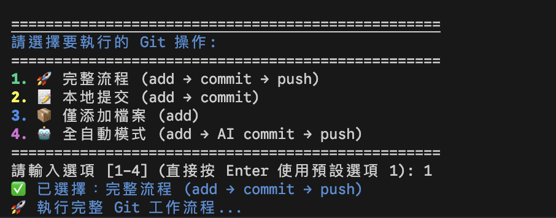
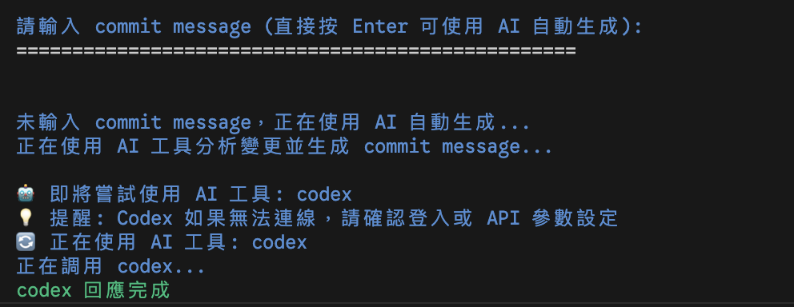
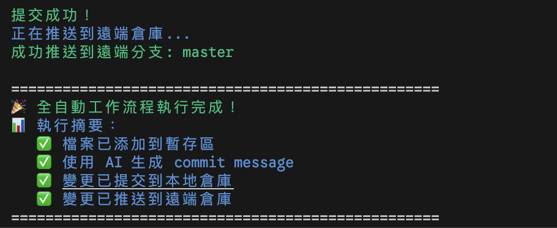
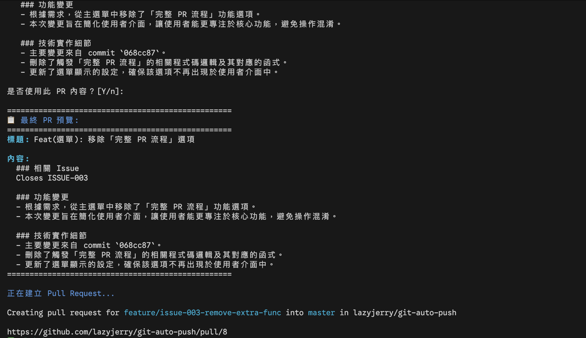
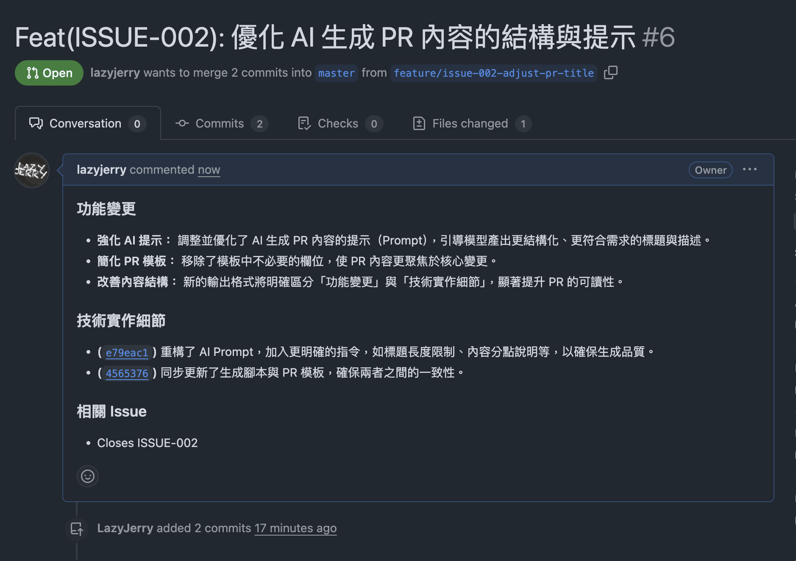

🌐 [English](README_EN.md) | [简体中文](README_CN.md) | [繁體中文](README.md) | 日本語 | [한국어](README_KR.md)

---

# Git ワークフロー自動化ツールセット

2つの Bash スクリプトで、従来の Git 操作（add/commit/push）と GitHub Flow PR フローをそれぞれ処理します。複数の AI CLI ツールによる commit メッセージと PR コンテンツの生成をサポートし、Conventional Commits プレフィックス、メッセージ品質チェック、タスク番号の自動挿入などの機能も提供します。

バージョン：v2.8.0

## プロジェクト概要

### 主な機能

- 従来の Git ワークフロー自動化（add、commit、push）
- Conventional Commits プレフィックスサポート（手動選択または AI 自動判定）
- コマンドラインから直接実行（`./git-auto-push.sh 1-7` でメニューをスキップ）
- Git リポジトリ情報の表示（ブランチ状態、リモート、同期状態、コミット履歴）
- Commit メッセージの修正（最後のコミットを安全に修正、タスク番号対応）
- Commit メッセージ品質チェック（AI による品質分析、自動または確認モードを設定可能）
- GitHub Flow PR フロー（ブランチ作成から PR 作成まで）
- PR ライフサイクル管理（作成、取り消し、レビュー、マージ）
- ブランチ管理（安全な削除、メインブランチ保護、多重確認）
- AI による commit メッセージ、ブランチ名、PR コンテンツの生成
- マルチ AI ツールフォールバック（1つ失敗すると自動的に次のツールに切り替え）
- エラー処理と修正提案
- 中断復旧とシグナル処理

## システムアーキテクチャ

### コアコンポーネント

```
├── git-auto-push.sh         # 従来の Git 操作自動化（2552 行）
├── git-auto-pr.sh           # GitHub Flow PR フロー自動化（2769 行）
├── Conventional Commits      # プレフィックスサポート：手動選択、AI 判定、スキップ
├── AI ツールモジュール        # copilot / gemini / codex / claude
│   ├── フォールバック機能    # ツール失敗時の自動切り替え
│   ├── 出力クリーニング      # AI メタデータのフィルタリング
│   └── 品質チェック          # commit メッセージの品質分析
├── タスク番号                # ブランチ名から issue key を解析（JIRA、GitHub Issue）
├── Commit メッセージ修正     # 最後のコミットを安全に修正、二重確認
├── インタラクティブメニュー   # 操作オプションとユーザーインターフェース
├── デバッグモード            # AI ツール実行詳細の追跡
├── シグナル処理              # trap cleanup と中断復旧
└── エラー処理                # 異常検出と修正提案
```

### プロジェクト構造

```
├── git-auto-push.sh      # 従来の Git 自動化ツール
├── git-auto-pr.sh        # GitHub Flow PR 自動化ツール
├── LICENSE              # MIT ライセンス
├── README.md            # プロジェクト説明ファイル
├── .github/             # GitHub 関連設定
│   └── copilot-instructions.md    # AI エージェント開発ガイド
├── docs/                # ドキュメントディレクトリ
│   ├── git-auto-push.mermaid             # Git 自動化フローチャート
│   ├── git-auto-pr.mermaid               # PR フローチャート
│   ├── git_auto_push_workflow.png        # Git ワークフロー図
│   ├── git_pr_automation.png             # PR 自動化図
│   └── reports/                          # 詳細ドキュメントレポート
│       ├── FEATURE-AMEND.md              # commit メッセージ変更機能の説明
│       ├── FEATURE-COMMIT-QUALITY.md     # Commit 品質チェック機能の説明
│       ├── COMMIT-QUALITY-SUMMARY.md     # Commit 品質チェック概要
│       ├── COMMIT-QUALITY-QUICKREF.md    # Commit 品質クイックリファレンス
│       ├── AI-QUALITY-CHECK-IMPROVEMENT.md # AI 品質チェック改善の説明
│       └── 選項7-變更commit訊息功能開發報告.md # オプション 7 開発レポート
└── screenshots/         # インターフェース表示画像
    ├── ai-commit-generation.png
    ├── auto-mode.png
    ├── main-menu.png
    ├── pr-screenshot-cli.png
    └── pr-screenshot-web.png
```

## インストールと起動

> 完全なインストールガイドは [INSTALLATION.md](INSTALLATION.md) をご覧ください

### ワンクリックインストール

```bash
# インタラクティブインストール（デフォルトで ~/.local/bin にインストール）
curl -fsSL https://raw.githubusercontent.com/lazyjerry/git-auto-push/refs/heads/master/install.sh | sh

# グローバルインストール（/usr/local/bin にインストール、sudo が必要）
curl -fsSL https://raw.githubusercontent.com/lazyjerry/git-auto-push/refs/heads/master/install.sh | sh -s -- --global

# アンインストール
curl -fsSL https://raw.githubusercontent.com/lazyjerry/git-auto-push/refs/heads/master/install.sh | sh -s -- --uninstall
```

### クイックインストール

```bash
# プロジェクトをクローン
git clone https://github.com/lazyjerry/git-auto-push.git
cd git-auto-push

# 実行権限を設定
chmod +x git-auto-push.sh git-auto-pr.sh

# テスト実行
./git-auto-push.sh --help
```

### グローバルインストール（オプション）

```bash
# システムパスにインストールし、任意のディレクトリから直接呼び出し可能
sudo install -m 755 git-auto-push.sh /usr/local/bin/git-auto-push
sudo install -m 755 git-auto-pr.sh /usr/local/bin/git-auto-pr
```

### 依存ツール

| ツール | 用途 | 必要性 |
|--------|------|--------|
| **GitHub CLI** | PR フロー操作 | `git-auto-pr.sh` に必須 |
| **AI CLI ツール** | コンテンツ自動生成 | オプション（インストール推奨） |

```bash
# GitHub CLI のインストール (macOS)
brew install gh && gh auth login
```

### パーソナライズ設定

外部設定ファイルでカスタマイズ可能。スクリプトの変更は不要です：

```bash
# 設定ディレクトリを作成し、設定例をコピー
mkdir -p ~/.git-auto-push-config
cp .git-auto-push-config/.env.example ~/.git-auto-push-config/.env

# 設定を編集
nano ~/.git-auto-push-config/.env
```

**設定ファイルの優先順位**：カレントディレクトリ → Home ディレクトリ → スクリプトディレクトリ

よく使う設定オプション：

```bash
# AI ツールの優先順序
AI_TOOLS=("copilot" "claude" "gemini" "codex")

# デフォルトユーザー名
DEFAULT_USERNAME="your-name"

# デバッグモード
IS_DEBUG=false
```

> その他のインストールオプションと AI ツールのインストールについては [INSTALLATION.md](INSTALLATION.md) をご参照ください

## 使用方法

> 完全な操作ガイドは [USAGE.md](USAGE.md) をご覧ください

### 機能一覧

| ツール | 用途 | コア機能 |
|--------|------|----------|
| **git-auto-push.sh** | 従来の Git 自動化 | Add, Commit, Push, メッセージ変更, リポジトリ情報 |
| **git-auto-pr.sh** | GitHub Flow 自動化 | ブランチ作成, PR 作成, PR レビュー, PR 取り消し, ブランチ削除 |

### よく使うコマンド早見表

#### git-auto-push.sh

```bash
# インタラクティブメニュー（推奨）
./git-auto-push.sh

# 指定機能を即座に実行
./git-auto-push.sh 1    # 完全フロー (add → commit → push)
./git-auto-push.sh 4    # 全自動モード (AI がコンテンツを生成)
./git-auto-push.sh 7    # 最後の commit メッセージを修正

# その他のオプション
./git-auto-push.sh --version   # バージョンを表示
./git-auto-push.sh --auto      # 全自動モード
```

#### git-auto-pr.sh

```bash
# インタラクティブメニュー
./git-auto-pr.sh

# プロンプトに従って選択：
# 1. 機能ブランチを作成 (jerry/feature/issue-123)
# 2. Pull Request を作成 (AI がコンテンツを生成)
# 4. PR をレビューしてマージ
```

> Conventional Commits プレフィックス、AI コンテンツ生成、品質チェック、タスク番号の自動挿入などの機能に対応しています。詳細は [使用ガイド](USAGE.md) をご覧ください。

## 特徴的な機能

### AI コンテンツ生成

copilot、gemini、codex、claude の 4 種類の AI CLI ツールをサポートし、1つ失敗すると自動的に次のツールを試行します。出力は AI ツールのメタデータを自動的にクリーニングします。`IS_DEBUG=true` を有効にすると、プロンプト、diff 内容、出力結果を確認でき、デバッグに便利です。

**生成されるコンテンツ**

- commit メッセージ：git diff を分析し、Conventional Commits に準拠したメッセージを生成
- 品質チェック：AI が commit メッセージの記述が明確かチェック。自動チェックまたは確認モードを設定可能。AI 失敗時もコミットに影響なし
- タスク番号：ブランチ名から issue key を解析（JIRA `PROJ-123`、GitHub Issue `feat-001` に対応）し、自動的に commit プレフィックスに追加。オプション 1、2、4、5、7 をカバー
- ブランチ名：issue key、オーナー、タイプに基づいてフォーマットされた名前を生成（例：`username/type/issue-key`）
- PR コンテンツ：ブランチの変更履歴に基づいてタイトルと説明を生成

### エラー処理

- `401 Unauthorized`、`token_expired`、`stream error` などのエラーを自動検出し、対応する修正コマンドを提供
- PR の自己承認制限を検出し、代替案を提供
- カラーフォーマットされたエラーメッセージ
- Ctrl+C による中断終了をサポートし、一時リソースを自動クリーンアップ

### ワークフロー

**git-auto-push.sh**

- 7 種類の操作モード。段階的な実行（add → commit → push）またはワンクリック完了をサポート
- リポジトリ情報の表示：ブランチ、リモート、同期状態、コミット履歴
- 最後の commit メッセージの修正（オプション 7）
- ブランチ名からタスク番号を自動挿入

**git-auto-pr.sh**

- ブランチ作成から PR 作成までのフロー
- PR 取り消し：PR の状態を検出し、オープンまたはマージ済みの PR を安全に処理
- メインブランチの自動検出。見つからない場合は修正提案を表示
- ユーザー ID を検出して自己承認を防止し、チームレビューまたは直接マージのオプションを提供
- revert 操作はデフォルトで「いいえ」、影響分析を表示
- ブランチの安全な削除、メインブランチの保護

## トラブルシューティング

### よくある問題と解決策

**エラー：`現在のディレクトリは Git リポジトリではありません！`**

```bash
# Git リポジトリのルートディレクトリで実行していることを確認
git init  # または正しい Git リポジトリディレクトリに移動
```

**エラー：`コミットする変更がありません`**

- ファイルの変更があるか確認：`git status`
- または既存のコミットをリモートにプッシュ

AI ツール認証エラー

```bash
❌ codex 認証エラー: 認証トークンが期限切れ
💡 以下のコマンドを実行して codex に再ログインしてください:
   codex auth login
```

`401 Unauthorized` または `token_expired` エラーが発生した場合は、プロンプトに従って再認証してください。

GitHub CLI 関連エラー（git-auto-pr.sh）

```bash
❌ gh CLI ツールがインストールされていません！実行してください：brew install gh
❌ gh CLI にログインしていません！実行してください：gh auth login
```

GitHub CLI がインストールされ、ログインしていることを確認してください。

**ブランチ状態エラー**

```bash
❌ メインブランチ (master) から PR を作成できません
❌ ブランチがまだリモートにプッシュされていません
```

機能ブランチで操作し、GitHub にプッシュ済みであることを確認してください。

**PR レビュー権限エラー**

```bash
❌ Can not approve your own pull request
⚠️  自分の Pull Request を承認できません
```

GitHub のセキュリティポリシーにより、開発者は自分の PR を承認できません。チームメンバーにレビューを依頼するか、権限がある場合は直接マージできます。

**PR 取り消し関連エラー**

```bash
❌ 現在のブランチに関連する PR が見つかりません
⚠️ PR はすでにマージされており、revert を実行すると後続の変更に影響します
```

PR 取り消しのよくあるケース：

- PR が見つからない：正しい機能ブランチにいることを確認
- マージ済み PR：システムが影響範囲を表示。revert はデフォルトで明示的な確認が必要
- revert の競合：プロンプトに従って手動で解決
- 権限不足：PR のクローズまたはメインブランチへのプッシュ権限があることを確認

**メインブランチの自動検出**

ツールはリモートの `origin/main`、`origin/master` を順番に試行し、最後にローカルブランチを確認します。main と master の両方の命名に対応しています。

**AI ツールネットワークエラー**

```bash
❌ codex ネットワークエラー: stream error: unexpected status
💡 ネットワーク接続を確認するか、後でもう一度お試しください
```

ネットワークの問題は自動的に検出され、提案が表示されます。

**AI ツールが使用できない**

```bash
# AI CLI ツールがインストールされ、実行可能か確認
which codex
which gemini
which claude
```

権限不足エラー

```bash
# スクリプトに実行権限があることを確認
chmod +x git-auto-push.sh
chmod +x git-auto-pr.sh
```

**プッシュ失敗**

- リモートリポジトリの接続を確認：`git remote -v`
- ネットワーク接続と認証設定を確認

## 高度な使用方法

### GitHub Flow ベストプラクティス

2つのスクリプトは [GitHub Flow](docs/github-flow.md) ワークフローをサポートしています：

**ツールの選択**

- **git-auto-push.sh**: 個人開発、実験プロジェクト、クイックプロトタイプ
- **git-auto-pr.sh**: チーム共同作業、正式な機能開発

### 実際のワークフロー例

**個人開発フロー**

```bash
# 素早いコミットとプッシュ
git-auto-push --auto
```

**チーム共同作業フロー**

```bash
# 1. 機能ブランチを作成
git-auto-pr                    # オプション 1 を選択

# 2. 開発完了後
git-auto-pr                    # オプション 2 を選択（コミット＆プッシュ）

# 3. レビュー用 PR を作成
git-auto-pr                    # オプション 3 を選択（PR 作成）
```

## 開発・修正時の注意事項

### コードアーキテクチャの説明

プロジェクトはモジュール化設計を採用しており、主なコンポーネントは以下の通りです：

#### 設定エリア概要

- **場所**：2つのスクリプトファイルの先頭部分
- **git-auto-push.sh**：28-52 行目 - AI ツールの優先順序とプロンプト設定
- **git-auto-pr.sh**：25-125 行目 - AI プロンプトテンプレート、ツール設定、ブランチ設定、ユーザー設定
- **修正方針**：すべての設定はファイルの上部に集約されており、保守と修正が容易

#### ブランチ設定

**git-auto-pr.sh** のブランチ設定機能：

- **メインブランチ配列設定**：`DEFAULT_MAIN_BRANCHES=("main" "master")`
- **デフォルトユーザー設定**：`DEFAULT_USERNAME="jerry"` - オーナー名をカスタマイズ可能
- **自動検出**：順番に最初に存在するブランチを検出
- **エラー処理**：ブランチが見つからない場合に解決策を提供
- `develop`、`dev` などのブランチオプションを追加可能

#### 統一変数管理

- **AI_TOOLS 変数**：統一された AI ツール優先順序配列
- **条件付き代入**：`: "${VAR:=default}"` 構文を使用し、設定ファイルがデフォルト値より優先
- **デフォルト呼び出し順序**：copilot → gemini → codex → claude（設定ファイルで上書き可能）

### コードドキュメント標準

すべての主要関数は以下のフォーマットを採用しています：

```bash
# ============================================
# 関数名
# 機能：関数の用途と動作の詳細な説明
# パラメータ：$1 - パラメータ説明、$2 - パラメータ説明
# 戻り値：戻り値の意味とエラーコード
# 使用例：具体的な呼び出し例
# 注意：セキュリティ上の考慮事項と特殊なケース
# ============================================
```

**ドキュメントカバー範囲**：ユーティリティ関数、コアロジック、セキュリティメカニズム、使用例

### 修正ガイドライン

#### 1. AI プロンプトの修正

```bash
# 修正場所：ファイル先頭の AI プロンプト設定エリア
generate_ai_commit_prompt() {
    # commit メッセージ生成ロジックの修正
}

generate_ai_pr_prompt() {
    # PR コンテンツ生成ロジックの修正
}
```

**注意**：ブランチ名は現在自動生成に変更されており、AI による生成は使用されていません。

#### 2. AI ツール順序の調整

```bash
# 方法 1：設定ファイルで上書き（推奨）
# ~/.git-auto-push-config/.env
AI_TOOLS=("copilot" "codex" "gemini" "claude")

# 方法 2：スクリプトのデフォルト値を修正（上級）
# AI_TOOLS デフォルト値ブロックを見つけ、配列内容を修正
AI_TOOLS=(
    "copilot"   # 第 1 優先
    "codex"     # 第 2 優先
    "gemini"    # 第 3 優先
    "claude"    # 第 4 優先
)
```

#### 3. 新しい AI ツールの追加

1. `AI_TOOLS` 配列に新しいツール名を追加
2. 対応する関数に case ブランチ処理を追加
3. 対応する `run_*_command()` 関数を実装

#### 4. Commit 品質チェック設定

```bash
# git-auto-push.sh Commit 品質チェック設定（約 149 行目）
AUTO_CHECK_COMMIT_QUALITY=true

# 自動チェックモード（デフォルト）- 毎回 commit 前に自動チェック
AUTO_CHECK_COMMIT_QUALITY=true

# 確認モード - コミット前にチェックするか確認（デフォルトは「いいえ」）
AUTO_CHECK_COMMIT_QUALITY=false
```

**設定説明**：

- **自動チェックモード（true）**：毎回 commit 前に自動チェック。チーム規範が厳格なプロジェクトに適合
- **確認モード（false）**：コミット前にチェックするか確認。素早いコミットシーンに適合
- AI ツール失敗時はチェックを自動スキップし、コミットに影響なし

#### 5. ブランチ設定のカスタマイズ

```bash
# 方法 1：設定ファイルで上書き（推奨）
# ~/.git-auto-push-config/.env
DEFAULT_MAIN_BRANCHES=("main" "master" "develop")
DEFAULT_USERNAME="tom"
AUTO_DELETE_BRANCH_AFTER_MERGE=true

# 方法 2：スクリプトのデフォルト値を修正（上級）
# メインブランチ候補リスト
DEFAULT_MAIN_BRANCHES=("main" "master")

# デフォルトユーザー名
DEFAULT_USERNAME="jerry"

# PR マージ後のブランチ削除ポリシー（true=自動削除、false=保持）
AUTO_DELETE_BRANCH_AFTER_MERGE=false
```

**設定説明**：

- **検出順序**：スクリプトは配列の順序で最初に存在するブランチを検出
- **デフォルトユーザー**：ブランチ作成時のオーナー名。実行時に上書き可能
- **ブランチ削除ポリシー**：PR マージ後にブランチを自動削除するかどうかを制御
  - `false`（デフォルト）：ブランチを保持
  - `true`：自動削除
- ブランチが見つからない場合はエラーメッセージと解決策を表示

#### 6. エラー処理の拡張

- 既存のエラー検出関数に新しいエラーパターンを追加
- エラーメッセージと修正提案を更新
- 一貫したエラー出力フォーマットを維持

### 重要な注意事項

#### 同期修正の要件

- **AI ツール**：修正時は 2つのスクリプトを同時に更新する必要あり
- **プロンプト**：2つのファイルのスタイルを一貫させる
- **エラー処理**：統一された処理モデルと出力フォーマット

#### 機能テスト

```bash
# 構文チェック
bash -n git-auto-push.sh
bash -n git-auto-pr.sh

# 機能テスト
./git-auto-push.sh --help
./git-auto-pr.sh --help

# AI ツールテスト
source git-auto-push.sh
for tool in "${AI_TOOLS[@]}"; do echo "テスト $tool"; done
```

#### バージョン管理

- 修正後にバージョン番号を更新
- README の行数統計を更新
- 重要な変更を commit message に記録

### よくある修正シナリオ

#### シナリオ 1：AI プロンプトの最適化

1. 対応する `generate_ai_*_prompt()` 関数を修正
2. 生成結果をテスト
3. 関連ドキュメントを更新

#### シナリオ 2：新しいエラー処理の追加

1. 新しいエラーパターンを特定
2. 検出関数に条件判定を追加
3. 具体的な修正提案を提供

#### シナリオ 3：ワークフローの調整

1. `execute_*_workflow()` 関数を修正
2. メニュー表示を更新
3. フローをテスト

## 更新履歴

> 完全なバージョン履歴は [CHANGELOG.md](CHANGELOG.md) をご覧ください

- 最新バージョン：v2.8.0 (2026-02-01)
- 総バージョン数：16 のメジャーバージョン
- 開発期間：2025-08-21 から現在
- コード行数：`git-auto-push.sh` 2,552 行、`git-auto-pr.sh` 2,769 行、`install.sh` 773 行

### 参考リソース

- [CHANGELOG.md](CHANGELOG.md) - 完全なバージョン履歴と機能変更記録
- [.github/copilot-instructions.md](.github/copilot-instructions.md) - AI エージェント開発ガイド
- [docs/github-flow.md](docs/github-flow.md) - GitHub Flow の説明
- [docs/pr-cancel-feature.md](docs/pr-cancel-feature.md) - PR 取り消し機能の詳細説明
- [docs/git-info-feature.md](docs/git-info-feature.md) - Git リポジトリ情報機能の説明
- [docs/FEATURE-AMEND.md](docs/FEATURE-AMEND.md) - commit メッセージ変更機能の説明
- [docs/FEATURE-COMMIT-QUALITY.md](docs/FEATURE-COMMIT-QUALITY.md) - Commit 品質チェック機能の説明

## スクリーンショット

git-auto-pr.sh メインメニュー：

AI による Git コミットメッセージの自動生成：

git-auto-push.sh 全自動操作モード：

コマンドラインでの PR 作成フロー：

GitHub ウェブでの PR 作成結果：

## ライセンス

本プロジェクトは MIT ライセンスの下で公開されています。詳細は [LICENSE](LICENSE) ファイルをご参照ください。
